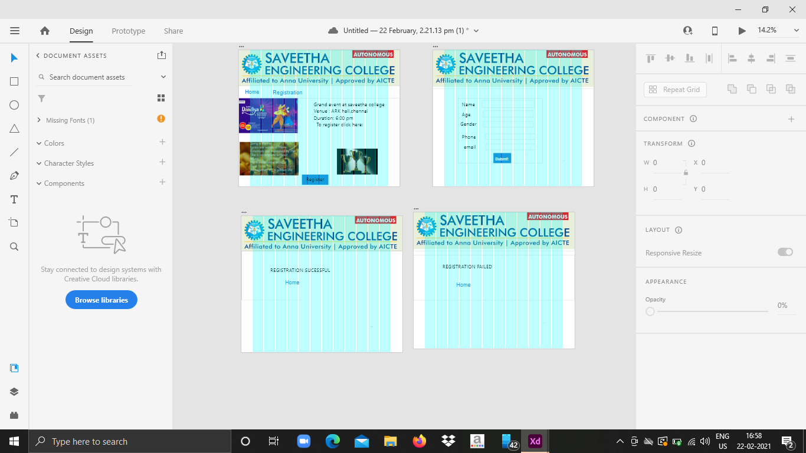
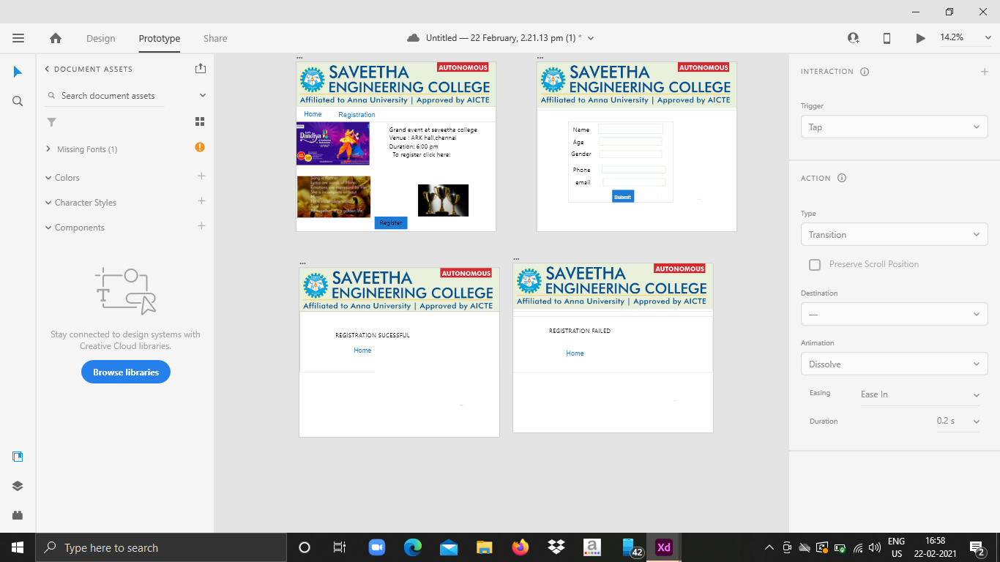
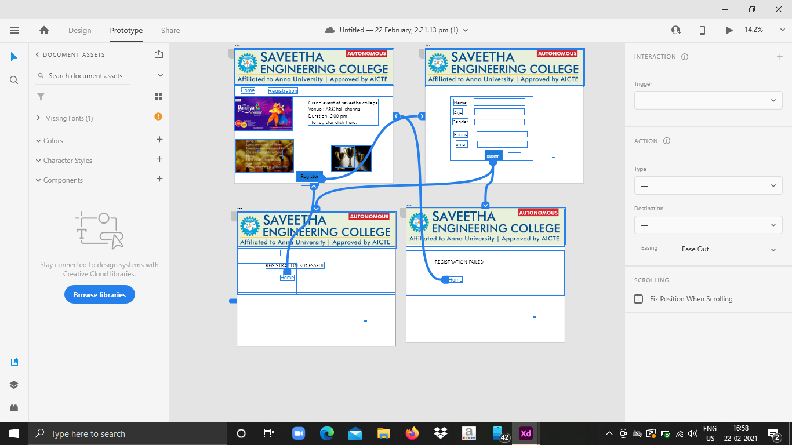
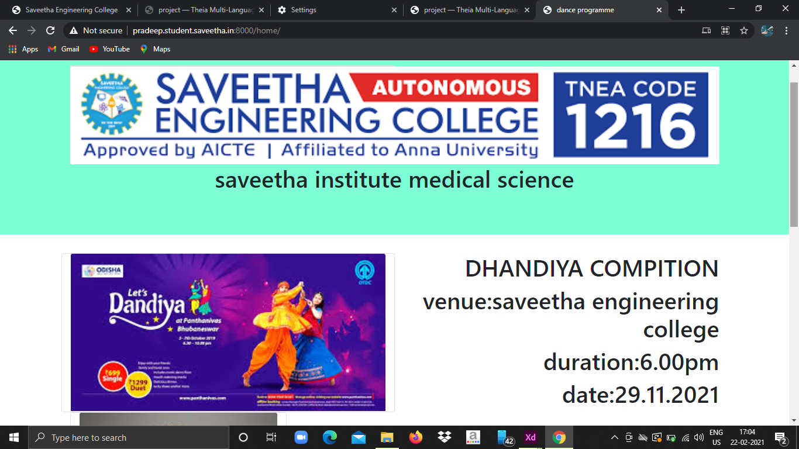
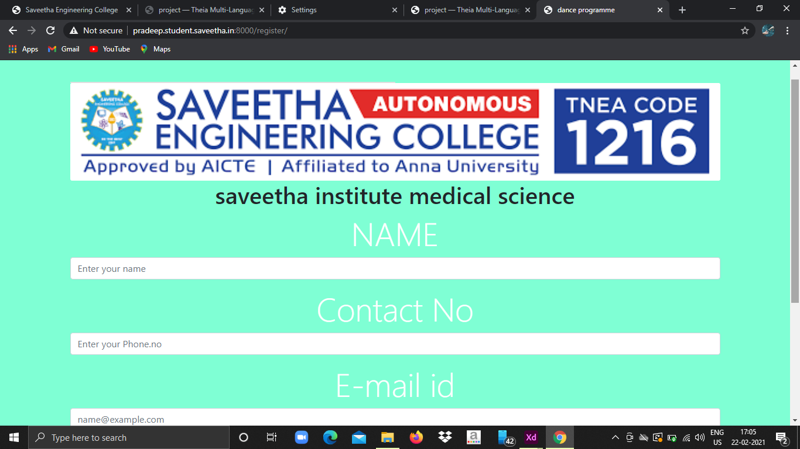
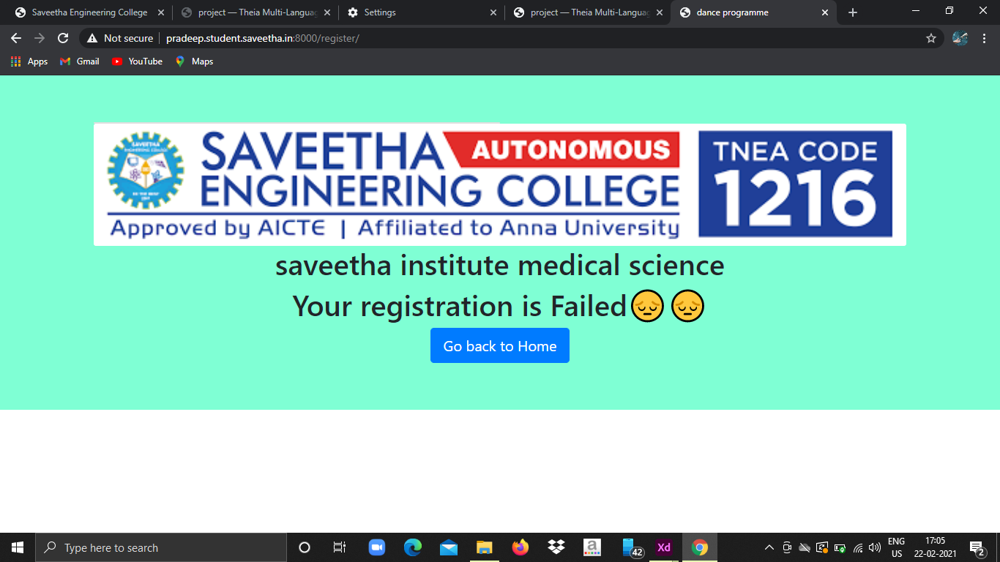

# WebApplication for Event Registration

## AIM:
To create a UX design and develop a web application for event registration.
## DESIGN STEPS:

## DESIGN SCREENS:





## WIREFRAME:



## PROTOTYPE:


## PROGRAM:
### home.html
```
<!doctype html>
<html lang="en">

<head>
    <!-- Required meta tags -->
    <meta charset="utf-8">
    <meta name="viewport" content="width=device-width, initial-scale=1, shrink-to-fit=no">

    <!-- Bootstrap CSS -->
    <link rel="stylesheet" href="https://maxcdn.bootstrapcdn.com/bootstrap/4.0.0/css/bootstrap.min.css"
        integrity="sha384-Gn5384xqQ1aoWXA+058RXPxPg6fy4IWvTNh0E263XmFcJlSAwiGgFAW/dAiS6JXm" crossorigin="anonymous">

    <title>dance programme</title>
</head>

<body>
    <div class="jumbotron jumbotron-fluid" style="background-color:aquamarine;">
        <div class="container  text-center">
            <div class="card col-12 col-md-6 col-lg-6"></div>
            
            <h1>saveetha institute medical science</h1>
        </div>
    </div>

    <div class="container text-center" style="text-align:aquamarine;">
        <div class="row">
            <div class="card col-12 col-md-6 col-lg-6">
                
            </div>

            <div class="col-6">
                <h1 class="text-right">DHANDIYA COMPITION</h1>
                <h1 class="text-right">venue:saveetha engineering college</h1>
                <h1 class="text-right">duration:6.00pm</h1>
                <h1 class="text-right">date:29.11.2021</h1>
            </div>
        </div>
    </div>

    <div class="container text-right">
        <div class="row">

            </div>
            <div class="card col-12 col-md-6 col-lg-4">
                
            </div>
            <div class="card col-12 col-md-6 col-lg-4">
                
            </div>
        </div>
    </div>
    <div class="container">
        <div class="row">
            <div class="col-12 text-center">
                <a href="/register/" class="btn btn-primary btn-lg" role="button">Register</a>
            </div>
        </div>
    </div>

    <!-- Optional JavaScript -->
    <!-- jQuery first, then Popper.js, then Bootstrap JS -->
    <script src="https://code.jquery.com/jquery-3.2.1.slim.min.js"
        integrity="sha384-KJ3o2DKtIkvYIK3UENzmM7KCkRr/rE9/Qpg6aAZGJwFDMVNA/GpGFF93hXpG5KkN"
        crossorigin="anonymous"></script>
    <script src="https://cdnjs.cloudflare.com/ajax/libs/popper.js/1.12.9/umd/popper.min.js"
        integrity="sha384-ApNbgh9B+Y1QKtv3Rn7W3mgPxhU9K/ScQsAP7hUibX39j7fakFPskvXusvfa0b4Q"
        crossorigin="anonymous"></script>
    <script src="https://maxcdn.bootstrapcdn.com/bootstrap/4.0.0/js/bootstrap.min.js"
        integrity="sha384-JZR6Spejh4U02d8jOt6vLEHfe/JQGiRRSQQxSfFWpi1MquVdAyjUar5+76PVCmYl"
        crossorigin="anonymous"></script>
</body>

</html>
```
### register.html
```
<!doctype html>
<html lang="en">

<head>
    <!-- Required meta tags -->
    <meta charset="utf-8">
    <meta name="viewport" content="width=device-width, initial-scale=1, shrink-to-fit=no">

    <!-- Bootstrap CSS -->
    <link rel="stylesheet" href="https://stackpath.bootstrapcdn.com/bootstrap/4.1.3/css/bootstrap.min.css"
        integrity="sha384-MCw98/SFnGE8fJT3GXwEOngsV7Zt27NXFoaoApmYm81iuXoPkFOJwJ8ERdknLPMO" crossorigin="anonymous">
 
     <title>dance programme</title>
</head>

<body>
    <div class="jumbotron jumbotron-fluid" style="background-color:aquamarine;">
        <div class="container  text-center">
            <div class="card col-12 col-md-6 col-lg-6"></div>
            
            <h1>saveetha institute medical science</h1>
        </div>
    <form action="" method="POST">
        
        <div class="container display-4 text-center" style=color:white >
        <div class="form-group">
            <label for="username">NAME</label>
            <input type="text" class="form-control" id="username" name="username" placeholder="Enter your name">
        </div>
        <div class="form-group">
            <label for="phone">Contact No</label>
            <input type="text" class="form-control" id="phone" name="phone" placeholder="Enter your Phone.no">
        </div>
        <div class="form-group">
            <label for="email">E-mail id</label>
            <input type="email" class="form-control" id="email" name="email" placeholder="name@example.com">
        </div>
        <div class="form-group">
            <label for="Institution">Institution</label>
            <input type="text" class="form-control" id="Institution" name="institution" placeholder="Institution name">
        </div>
        <div class="col-12 text-center">
              <button type="submit" class="btn btn-primary btn-lg">Submit</button>
              <a href="/home/"class="btn btn-primary btn-lg" role="button" aria-pressed="true">Cancel</a>
        </div>
    </div>
    </form>

    <!-- Optional JavaScript -->
    <!-- jQuery first, then Popper.js, then Bootstrap JS -->
    <script src="https://code.jquery.com/jquery-3.3.1.slim.min.js"
        integrity="sha384-q8i/X+965DzO0rT7abK41JStQIAqVgRVzpbzo5smXKp4YfRvH+8abtTE1Pi6jizo"
        crossorigin="anonymous"></script>
    <script src="https://cdnjs.cloudflare.com/ajax/libs/popper.js/1.14.3/umd/popper.min.js"
        integrity="sha384-ZMP7rVo3mIykV+2+9J3UJ46jBk0WLaUAdn689aCwoqbBJiSnjAK/l8WvCWPIPm49"
        crossorigin="anonymous"></script>
    <script src="https://stackpath.bootstrapcdn.com/bootstrap/4.1.3/js/bootstrap.min.js"
        integrity="sha384-ChfqqxuZUCnJSK3+MXmPNIyE6ZbWh2IMqE241rYiqJxyMiZ6OW/JmZQ5stwEULTy"
        crossorigin="anonymous"></script>
</body>

</html>
```
### listofparticpants
```
<!doctype html>
<html lang="en">

<head>
    <!-- Required meta tags -->
    <meta charset="utf-8">
    <meta name="viewport" content="width=device-width, initial-scale=1, shrink-to-fit=no">

    <!-- Bootstrap CSS -->
    <link rel="stylesheet" href="https://maxcdn.bootstrapcdn.com/bootstrap/4.0.0/css/bootstrap.min.css"
        integrity="sha384-Gn5384xqQ1aoWXA+058RXPxPg6fy4IWvTNh0E263XmFcJlSAwiGgFAW/dAiS6JXm" crossorigin="anonymous">

    <title>List of Participants</title>
</head>

<body>
    <div class="jumbotron jumbotron-fluid" style="background-color:aquamarine;">
        <div class="container  text-center">
            
            
    </div>
    
        <div class="container">
        <h1 class="display-8 text-center" style=color:white font-style=helvetica>WORKSHOP ON IOT</h1>
        </div>
    </div>
    
    <div class="container" style=color:beige>
        <table class="table  table-striped table-dark" style=color:beige>
            <thead>
                <tr>
                    <th scope="col">Name</th>
                    <th scope="col">Email</th>
                    <th scope="col">Contact number</th>
                    <th scope="col">Institute</th>

                </tr>
            </thead>
            <tbody>
                

                <tr >
                    <td>{{col.username}}</td>
                    <td>{{col.email}}</td>
                    <td>{{col.phone}}</td>
                    <td>{{col.institution}}</td>

                </tr>
                


            </tbody>
        </table>
    </div>

    <!-- Optional JavaScript -->
    <!-- jQuery first, then Popper.js, then Bootstrap JS -->
    <script src="https://code.jquery.com/jquery-3.2.1.slim.min.js"
        integrity="sha384-KJ3o2DKtIkvYIK3UENzmM7KCkRr/rE9/Qpg6aAZGJwFDMVNA/GpGFF93hXpG5KkN"
        crossorigin="anonymous"></script>
    <script src="https://cdnjs.cloudflare.com/ajax/libs/popper.js/1.12.9/umd/popper.min.js"
        integrity="sha384-ApNbgh9B+Y1QKtv3Rn7W3mgPxhU9K/ScQsAP7hUibX39j7fakFPskvXusvfa0b4Q"
        crossorigin="anonymous"></script>
    <script src="https://maxcdn.bootstrapcdn.com/bootstrap/4.0.0/js/bootstrap.min.js"
        integrity="sha384-JZR6Spejh4U02d8jOt6vLEHfe/JQGiRRSQQxSfFWpi1MquVdAyjUar5+76PVCmYl"
        crossorigin="anonymous"></script>
</body>

</html>
```
### views.py
```
from django.shortcuts import render
from .models import participant
from django.core.exceptions import ValidationError

# Create your views here.
def home(request):
    context = {}
    return render(request, 'eventapp/home.html', context)

def register(request):
    context = {}

    if request.method == 'POST':
        p1=participant()
        p1.username = request.POST.get('username','-')
        p1.email = request.POST.get('email','-')
        p1.phone = request.POST.get('phone','000')
        p1.institution = request.POST.get('institution','-')

        if len(participant.objects.all()) > 5:
            return render (request, 'eventapp/failed.html',context)

        else:
            p1.save()
            return render (request, 'eventapp/success.html',context)

    if request.method == 'GET':
        context['username'] = ''
        context['email'] = ''
        context['phone'] = ''
        context['institution'] = ''

    return render(request, 'eventapp/register.html', context)

def listofparticipants(request):
    context = {}

    context['participants'] = participant.objects.all()

    return render(request, 'eventapp/listofparticipants.html', context)

def success(request):
    context = {}
    return render(request, 'eventapp/success.html', context)

def failed(request):
    context = {}
    return render(request, 'eventapp/failed.html', context)


```

## OUTPUT:






## RESULT:
Thus, a UX design and develop a web application for event registration has been done.
